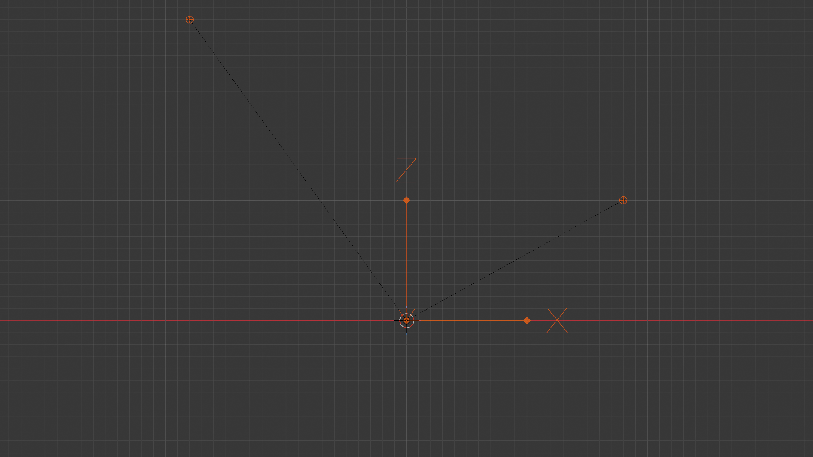

# Blender importer

`tools/blender_import_recording.py` loads a puppeteer-lab v3 recording into a
Blender scene as keyframed Empties, so a take can be scrubbed and previewed
inside Blender. It accepts either schema `"puppeteer-lab/recording"` (the
full file, including raw landmarks and audio) or `"puppeteer-lab/kinematics"`
(the lighter export-only file meant for animation tools: no raw landmarks or
audio, same keyframed Empties result). See
`components/shared/recordingSchema.ts` and
`docs/tdd/TDD-002-recording-schema-and-export.md`.

**Blender version:** 4.4+ (host-verified on 5.1.1). The importer's audio
import uses `SequenceEditor.strips`, which was renamed from `.sequences` in
Blender 4.4; a fallback to `.sequences` is included for older versions but
has not been tested.

## Running it

### From Blender's Text Editor

1. Open `tools/blender_import_recording.py` in a Text Editor area.
2. Either set `DEFAULT_JSON_PATH` near the bottom of the file to your
   recording's path, or set the `PUPPETEER_LAB_TAKE` environment variable
   before starting Blender.
3. Click **Run Script**.

### Headless / command line

```
blender --python tools/blender_import_recording.py -- path/to/take.json
```

The path after `--` is passed straight to the script; everything before it is
Blender's own argument handling.

### What it builds

- `scene.render.fps = round(capture.fps)`, `scene.frame_start = 0`,
  `scene.frame_end = round(durationMs / 1000 * fps)`.
- Per hand side present in the recording: an Empty `Hand.R` / `Hand.L`, each
  with 21 child Empties `Hand.R.00`..`Hand.R.20` (small spheres), one per
  MediaPipe hand landmark. Each frame's `location` is keyframed at
  `round(t / 1000 * fps)`. A `world[i]` entry that is `null` (a "partial"
  hand recorded from Motion Recorder's single tracked point, not a full
  MediaPipe landmark set) is skipped for that landmark on that frame, not
  treated as `(0, 0, 0)`.
- If any frame carries face data: a `Face` Empty with one custom property
  per blendshape, keyframed the same way. This is decided by scanning the
  frames for real face data, not by trusting `envelope.channels` alone --
  a literal `buildEnvelope()` output (Task 1) showed a `"hands"`-channel
  recording can still carry incidental face data per frame, since
  `mapFrameFace()` runs unconditionally regardless of `TrackingType`. Raw
  face landmark Empties (478 of them) exist but are off by default
  (`CREATE_FACE_LANDMARK_EMPTIES = False` at the top of the script) --
  heavy, and not needed for the blendshape-driven use case.
- If the recording carries audio (`envelope.audio`, `{mimeType, base64}`):
  writes `<name>.webm` next to the JSON and adds it as a Sound strip in the
  Sequencer at frame 1.
- A single Empty, `PuppeteerLab.AxisTriad` (display type `ARROWS`), at the
  origin, so the axes are visible in the viewport. See the orientation note
  below for how to read it.

## Axis remap

The app is Y-up (three.js); Blender is Z-up. Every point read from `world[]`
is remapped before it is written to an Empty's `location`:

```
(x, y, z) -> (x, -z, y)
```

So app X stays Blender X, app Y (up) becomes Blender Z (up), and app Z
(depth) becomes Blender -Y.

## Orientation / mirror note (the TDD's handedness risk)

`mapHandToWorld` mirrors X (`worldX = (0.5 - x) * xRange`): a MediaPipe
normalized `x` near 0 (screen-left in a front-camera, `facingMode: 'user'`
feed) is the user's physically **right** hand, and it maps to a *positive*
`world.x`. That mirror is already baked into the JSON's `world[]` values by
the time the importer sees them -- the importer does not add or undo any
left/right flip itself, it only swaps axes (Y-up to Z-up) as above.

**What was actually observed** (host-verified against the synthetic fixture
below, screenshot attached): a hand labeled `"side": "right"` in the JSON,
sitting at a fixed `world` position `(1.8, 1.0, 0.0)`, ends up at Blender
location `(1.8, 0, 1.0)` and renders on the **right-hand side** of Blender's
front orthographic view (positive X). The `"side": "left"` hand, rising from
`world.y = 0.5` to `2.5` over the take, sits at negative Blender X and
renders on the **left-hand side** of the same view. So in Blender's own
front view, a hand labeled `right` in the JSON reads as "the viewer's right"
too -- no extra mirroring is needed on top of the Y-up/Z-up axis swap. This
matches the mirrored-selfie convention the mapping was built from (see the
comment above `mapPointToWorld` in `recordingSchema.ts`), it just isn't
obvious without checking, which is exactly what this host verification was
for.

The `PuppeteerLab.AxisTriad` Empty draws Blender's own X (red) / Y (green) /
Z (blue, drawn orange-highlighted when selected) arrows at the origin so this
can be checked again on any future take without re-deriving it: X is the
mirrored left/right axis above, Z is up, and Y ("into the screen" in the
app's own view) is toward `-Y` in Blender after the axis remap.



## Verification status

**This was verified against a synthetic fixture, not a real Motion Recorder
take.** A camera was not available in this session (see `HANDOFF.md`'s open
items 1-4, the same camera-preview gap items 1-7 already note). The fixture
was built to match the exact shape `recordingSchema.ts`'s `buildEnvelope()`
produces (not a hand-typed guess): two `partial` hands (the Motion Recorder
pattern -- only `world[8]` populated, everything else `null`), a `"right"`
hand held fixed and a `"left"` hand rising steadily over a synthetic ~2.5s,
76-frame take, `capture.fps` deliberately a non-round float
(`29.970029970029972`) to exercise the importer's `round()` step. It was run
through `import_recording()` via the Blender MCP's `execute_blender_code`,
and the resulting scene was inspected directly (object list, per-frame
`location` values, keyframe counts) before the screenshot above was
captured. See the Task 3 report
(`.superpowers/sdd/2026-09-16-item6-schema-v3-blender-importer/task-3-report.md`)
for the exact values checked.

Still open, tracked in `HANDOFF.md`: running this against a **real** Motion
Recorder take (camera-recorded, not synthetic) to confirm the mirror holds
for actual MediaPipe output, not just hand-authored `world[]` values.
